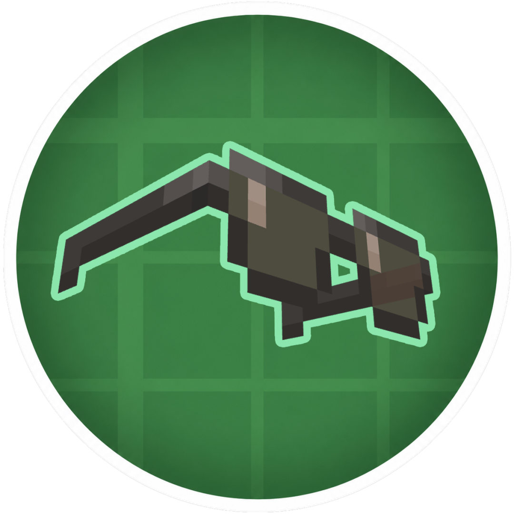

<p align="center">
  
</p>

<h1 align="center">Ultra Goggles</h1>

<p align="center">
  <strong>A cool goggles mod for Create</strong>
</p>

<p align="center">
  
  
  
</p>

---

## ✨ 功能

- 一个更帅的护目镜

## 📦 依赖

| 依赖 | 版本 | 类型 |
|------|------|------|
| Minecraft | 1.21.1 | 必需 |
| NeoForge | 21.1.229+ | 必需 |
| Create | 6.0.0 - 7.0 | 必需 |
| Curios API | 9.0+ | 可选 |

## 🤖 开发工具说明

> **本项目的大部分代码由 [Roo Code ​(CE)​](https://plugins.jetbrains.com/plugin/30824-roo-code-ce-)辅助编写。**


## 📄 许可证

本项目基于 **[GNU General Public License v3.0](LICENSE)** 开源。

```
Copyright (C) 2025 ZhanMing

This program is free software: you can redistribute it and/or modify
it under the terms of the GNU General Public License as published by
the Free Software Foundation, either version 3 of the License, or
(at your option) any later version.
```

---
<p align="center">
  <em>感谢您的关注！欢迎提交问题和贡献代码！</em>
